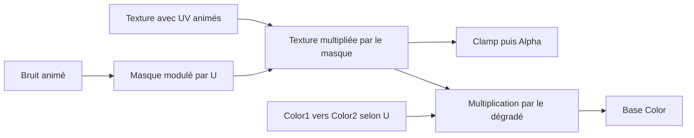

# Tech Art sous Unity — shaders, matériaux animés et effets visuels

Ce projet rassemble des expérimentations de rendu sous Unity : shaders écrits en HLSL, matériaux construits avec Shader Graph et prototype d’effet relié à des scripts de jeu. Ce document explique leur fonctionnement et les choix visibles dans les fichiers du dépôt.

Les quatre axes principaux sont l’éclairage, les effets de profondeur et de masquage, la projection triplanaire et les traînées animées. Les nuages procéduraux et le Ground Slash complètent ces recherches.

> État documenté : commit `ab7f22d`, du 31 janvier 2026. Le projet a été ajouté en un seul import après un premier commit contenant le `.gitignore`. Les sections ci-dessous décrivent sa construction technique, sans prétendre reconstituer l’ordre chronologique du développement. Les rendus et la compilation n’ont pas été vérifiés dans Unity pour cette documentation.

## Environnement

| Élément | Version enregistrée |
| --- | --- |
| Unity | 6000.0.58f1 |
| Universal Render Pipeline | 17.0.4 |
| Visual Effect Graph | 17.0.4 |

Le HLSL permet de détailler les calculs d’éclairage et les règles de rendu. Shader Graph sert à assembler les textures, les bruits et les animations sous forme de graphes. Les scripts C# apportent le déplacement, les commandes et le cycle de vie du prototype de projectile.

## 1. Construire un matériau éclairé en HLSL

Fichiers principaux : `Assets/Scenes/HLSL/BaseShader.shader` et `TextureShader.shader`.

### De la géométrie à la couleur

Le shader de base transforme les positions des sommets vers l’espace utilisé pour l’affichage avec `TransformObjectToHClip`. Il transmet également les UV, après application du tiling et de l’offset du matériau.

Le fragment shader échantillonne ensuite une texture et la multiplie par une couleur :

```hlsl
float4 textureSample = tex2D(_BaseTex, i.uv);
return textureSample * _BaseColor;
```

Cette base sépare la forme du modèle, les coordonnées de texture et la teinte du matériau. `TextureShader.shader` y ajoute plusieurs composantes d’éclairage.

### Éclairage diffus et ambiant

Le diffus utilise le produit scalaire entre la normale de la surface et la direction de la lumière principale. Une surface orientée vers la lumière reçoit une contribution plus forte ; une surface tournée à l’opposé reçoit une contribution directe nulle.

```hlsl
float3 diffuse = mainLight.color * max(0, dot(i.normalWS, mainLight.direction));
float3 ambient = SampleSH(i.normalWS);
```

La contribution ambiante est ajoutée au diffus. Dans ce code, la couleur texturée est multipliée par cette somme. La lumière principale est récupérée, mais ce calcul ne multiplie pas explicitement le diffus par son atténuation d’ombre.

### Reflet spéculaire

Le reflet repose sur un demi-vecteur : la direction intermédiaire entre la lumière et la vue. Le produit scalaire avec la normale est élevé à la puissance `_GlossPower`.

```hlsl
float3 halfVector = normalize(mainLight.direction + i.viewWS);
float specular = pow(max(0, dot(i.normalWS, halfVector)), _GlossPower);
```

Une puissance plus grande resserre le reflet. La valeur par défaut est `400`.

### Fresnel et émission

Le terme Fresnel augmente lorsque la surface est vue sous un angle rasant :

```hlsl
float fresnel = pow(1.0f - max(0, dot(i.normalWS, i.viewWS)), _FresnelPower);
```

Dans cette implémentation, ce terme est multiplié par le diffus avant d’être ajouté à la contribution spéculaire. L’accentuation des bords dépend donc aussi de l’éclairage direct.

Une variante activée par `ENABLE_EMSSIVE` ajoute `_EmissiveColor`. L’émission est ici une couleur ajoutée au résultat ; un halo lumineux à l’écran dépendrait aussi du post-traitement de la scène.

### Découpage de l’alpha et dithering

Le shader contient une grille de 16 seuils répétée en motif 4 × 4. Selon la position du pixel, l’alpha est comparé à un seuil différent. Les fragments rejetés produisent un motif de découpage, utilisable pour donner une impression de transparence sans mélange alpha classique.

Un second test rejette les fragments dont l’alpha est inférieur à `_ClipThreshold`. Les deux mécanismes sont donc présents en même temps.

La partie dithering reste à vérifier : le code appelle actuellement `ComputeScreenPos` avec la position objet, alors que ce calcul doit s’appuyer sur la position projetée pour obtenir les coordonnées écran attendues.

### Transparence configurable

`TransparentShader.shader` isole une autre approche : les facteurs source et destination du mélange sont exposés dans le matériau et utilisés par `Blend [_SrcBlend] [_DstBlend]`.

Le réglage par défaut vaut `1 / 1`, ce qui correspond à un mélange additif. La présence du shader permet d’expérimenter les facteurs de mélange ; elle ne signifie pas que tous les matériaux du projet utilisent une transparence alpha standard.

## 2. Utiliser la profondeur et le stencil

### Faire apparaître une intersection

Fichier : `Assets/Scenes/HLSL/Intersection.shader`.

Le shader lit la texture de profondeur de la scène avec `SampleSceneDepth`, puis convertit cette valeur avec `LinearEyeDepth`. Il la compare à la profondeur du fragment portée par `positionSS.w`.

Le masque de contact est calculé ainsi :

```hlsl
float intersectAmount = sceneEyeDepth - i.positionSS.w;
intersectAmount = saturate(1.0f - intersectAmount);
intersectAmount = pow(intersectAmount, _IntersectionPower);
return lerp(_BaseColor, _IntersectionColor, intersectAmount);
```

Lorsque les profondeurs sont proches, la couleur d’intersection prend davantage de place. `_IntersectionPower` ajuste le profil de la transition. Ce mécanisme sert de base à une coloration de contact entre deux surfaces.

Il dépend de la texture de profondeur et doit être contrôlé avec la caméra utilisée. Les assets de pipeline du dépôt n’activent pas tous cette texture. Le shader porte aussi des tags de transparence, mais ne déclare pas de mélange `Blend` : ces tags seuls ne rendent pas sa couleur semi-transparente.

### Afficher les parties masquées : X-ray

Fichier : `Assets/Scenes/HLSL/Xray.shader`.

L’effet repose sur deux états de rendu :

```hlsl
ZTest Greater
ZWrite Off
```

Le test laisse passer les fragments situés derrière une profondeur déjà écrite. Le shader les colore avec `_BaseColor`, sans modifier lui-même le tampon de profondeur.

Cela constitue la base d’un effet de silhouette derrière un obstacle. Le résultat dépend de l’ordre de rendu : les surfaces qui masquent l’objet doivent avoir écrit leur profondeur avant cette passe.

### Délimiter une zone avec le stencil

Fichiers : `StencilMask.shader` et `StencilTexture.shader` dans `Assets/Scenes/HLSL`.

Le premier shader écrit une valeur `_StencilRef` dans le stencil avec `Comp Always` et `Pass Replace`. Sa file `Geometry-1` le place avant les objets de la file géométrique standard.

Le second utilise `Comp Equal` : il affiche sa texture uniquement là où la valeur du stencil correspond à sa référence.

Le principe peut servir à découper une fenêtre de visibilité ou à révéler un matériau dans une zone précise. Dans l’état actuel, le shader de masque désactive l’écriture de profondeur mais n’inclut pas `ColorMask 0` ; son invisibilité dans le rendu couleur n’est donc pas explicitement garantie par le code.

## 3. Texturer sans dépendre des UV : projection triplanaire

Fichier : `Assets/Scenes/HLSL/Triplanar.shader`.

La projection triplanaire échantillonne une même texture selon trois orientations. Les coordonnées viennent de la position dans le monde :

```hlsl
float2 xAxisUV = i.positionWS.zy * _Tile;
float2 yAxisUV = i.positionWS.xz * _Tile;
float2 zAxisUV = i.positionWS.xy * _Tile;
```

Le shader calcule ensuite le poids de chaque projection à partir de la normale :

```hlsl
float3 weights = pow(abs(i.normalWS), _BlendPower);
weights *= rcp(weights.x + weights.y + weights.z);
```

La couleur finale est la somme des trois textures pondérées. Une face principalement orientée vers un axe utilise surtout la projection correspondante ; les orientations intermédiaires mélangent les projections.

| Paramètre | Effet |
| --- | --- |
| `_Tile` | Modifie la répétition de la texture dans l’espace monde. |
| `_BlendPower` | Contrôle la netteté de la transition entre les projections. |

Cette méthode est utile pour texturer un modèle sans utiliser ses UV. Elle demande trois échantillonnages de texture. Comme la projection est ancrée dans le monde, déplacer le modèle change aussi la portion de texture qu’il traverse.

Le shader expose `_BaseColor`, mais ne l’utilise actuellement pas dans la couleur retournée.

## 4. Construire des traînées animées avec Shader Graph

Fichiers : `Assets/Trails/Trails.shadergraph` et `LoveMachineTest.shadergraph`.

Ces graphes combinent une texture défilante, un bruit animé et un dégradé de couleur. Ils produisent le matériau de l’effet ; ils ne créent pas à eux seuls la géométrie d’une traînée.

### Deux animations indépendantes

La texture principale reçoit un offset calculé avec le temps et `MainTexSpeed`. Le bruit reçoit un autre offset calculé avec `DissolveSpeed`.

```text
Temps × MainTexSpeed  → offset des UV → texture principale
Temps × DissolveSpeed → offset des UV → Simple Noise
```

Les deux mouvements peuvent donc être réglés séparément. `DissolveScale` contrôle l’échelle du bruit.

### Un dégradé le long de l’effet

La composante U des UV alimente le facteur d’un `Lerp` entre `Color1` et `Color2`. La couleur évolue ainsi le long d’un axe de la géométrie, selon ses UV.

Le résultat est multiplié par la texture et le masque, puis envoyé à `Base Color`. Les graphes contiennent un bloc `Emission`, mais les connexions inspectées n’y relient pas cette chaîne de calcul.

### Un masque de dissolution renforcé par les UV

Dans `LoveMachineTest`, le bruit est directement multiplié par la texture.

`Trails` ajoute un traitement spatial : une composante U passe par `One Minus`, est ajoutée au bruit, puis cette même composante U est soustraite. Le masque avant multiplication par la texture peut donc se résumer à :

```text
masque = bruit + (1 − U) − U
       = bruit + 1 − 2U
```

Ce calcul favorise une extrémité et atténue l’autre. La texture multiplie ensuite le masque ; une conversion vers la sortie scalaire et un `Clamp` entre 0 et 1 alimentent l’alpha. Les graphes utilisent une surface transparente avec l’alpha clipping activé.

Il s’agit d’un masque animé par défilement du bruit et modulé dans l’espace. Aucun paramètre dédié de progression globale de dissolution n’est exposé dans ces graphes.



| Propriété | Rôle |
| --- | --- |
| `MainTex` | Motif principal de l’effet. |
| `MainTexSpeed` | Direction et vitesse du défilement de la texture. |
| `DissolveSpeed` | Direction et vitesse du défilement du bruit. |
| `DissolveScale` | Échelle du bruit. |
| `Color1`, `Color2` | Couleurs du dégradé piloté par U. |

## 5. Nuages procéduraux et déplacement des sommets

Fichier : `Assets/Shaders/Clouds.shadergraph`.

Le graphe utilise la position pour construire les coordonnées d’un `Gradient Noise`. Un nœud `Rotate About Axis` transforme cette projection, puis `Tiling And Offset` la fait défiler avec `Time × NoiseSpeed`.

Le bruit suit deux branches :

- Il multiplie une couleur constante pour alimenter `Base Color`.
- Il multiplie la normale, puis une amplitude, avant d’être ajouté à la position des sommets.

La seconde branche correspond au principe suivant :

```text
position finale = position initiale + normale × bruit × amplitude
```

L’entrée du nœud d’amplitude est enregistrée à `2`. Le déplacement est donc bien présent dans la chaîne du graphe. Sa finesse dépend notamment du nombre de sommets du maillage.

`Noise Scale` et `NoiseSpeed` sont exposés. `RotateProjection` sert à la fois d’axe de rotation et, via sa première composante, de valeur de rotation : ces contrôles ne sont pas indépendants dans le graphe actuel.

La cible du graphe est Unlit. Cette construction décrit un matériau procédural appliqué à une surface, sans simulation volumétrique de nuages.

## 6. Relier un effet à un prototype de jeu : Ground Slash

Fichiers principaux dans `Assets/GroundSlash` : `Ground Slash Shooter.cs`, `GroundSlash.cs`, `FirstPersonControllerScript.cs` et `GroundSlash.vfx`.

### Déclenchement et direction

Le script de tir surveille `Fire1`. Une temporisation limite la fréquence avec `1 / fireRate` ; la valeur par défaut est de quatre tirs par seconde.

Un rayon part du centre de la caméra. Le code choisit un point à 1 000 unités sur ce rayon, puis instancie le projectile à `firePoint`. Ce point n’est pas obtenu par une collision avec un obstacle.

Le projectile reçoit une orientation vers la destination, puis une vitesse de Rigidbody fondée sur la direction avant du tireur et la propriété `speed` du projectile.

### Positionnement au sol et durée de vie

`GroundSlash.cs` replace initialement le projectile à `Y = 0`. Dans `FixedUpdate`, un raycast vers le bas tente ensuite de récupérer la hauteur du sol ; en cas d’échec, le projectile revient à `Y = 0`.

La destruction est programmée après `destroyDelay`, soit cinq secondes par défaut. Une coroutine contient également une logique de ralentissement.

Le dossier comprend un VFX Graph avec les contextes de génération, d’initialisation et de mise à jour des particules, ainsi qu’une scène de test. Leur présence documente le travail sur l’effet ; l’assemblage complet doit être vérifié dans Unity.

### Limites actuelles du prototype

- Le ralentissement démarre avec `t = 1`, puis utilise `Lerp(Vector3.zero, vitesse, 1 - t)`. La première itération ramène donc immédiatement la vitesse à zéro.
- La direction de vitesse utilise `transform.forward` du tireur, tandis que l’orientation du projectile est calculée séparément vers la destination.
- Le code tente de limiter la rotation à Y en modifiant directement des composantes du quaternion ; ce n’est pas une méthode fiable pour supprimer le tangage et le roulis.
- Le raycast démarre une unité au-dessus du projectile, avec une portée par défaut de `0.1`. Ces valeurs ne suffisent pas à atteindre un sol situé une unité plus bas, sauf réglage différent dans la scène.

Ces points situent le Ground Slash comme un prototype dont le comportement reste à stabiliser.

## 7. Autres expérimentations et état du projet

`CubemapShader.shader` échantillonne une cubemap à partir de la normale en espace monde. Il explore l’utilisation d’une texture cubique ; il ne calcule pas un vecteur de réflexion dépendant de la caméra.

`PBR.shader` prépare des structures `SurfaceData` et `InputData`, puis appelle `UniversalFragmentPBR`. Il expose notamment des textures pour le métallique, la douceur, les normales, l’émission et l’occlusion. Plusieurs branchements restent à corriger : les calculs du métallique, de la douceur et des normales échantillonnent actuellement `_BaseTex`. La branche de lightmap dynamique contient aussi `bakedGO` à la place de `bakedGI`. Ce shader doit donc être présenté comme un travail en cours.

`Shield.shadergraph` contient les blocs de sortie d’un matériau Lit, sans réseau d’effet connecté. Il s’agit à ce stade d’une base de matériau.

## Explorer le dépôt

Les scènes `Assets/Scenes/HLSL/HLSL.unity` et `Assets/GroundSlash/Slash.unity` constituent des points d’entrée pour examiner les expérimentations correspondantes. Les matériaux et les graphes permettent ensuite de retrouver les paramètres détaillés ci-dessus.

Les captures et démonstrations vidéo restent à ajouter après vérification dans Unity. Elles permettront de comparer les réglages, de montrer le mouvement des effets et d’illustrer les limites des prototypes avec leur rendu réel.
